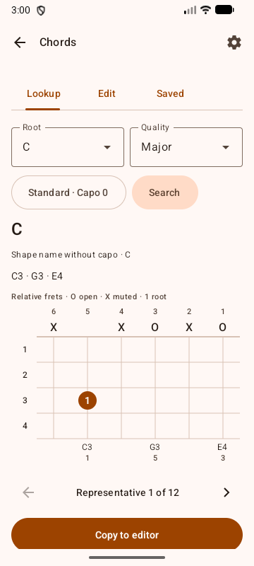
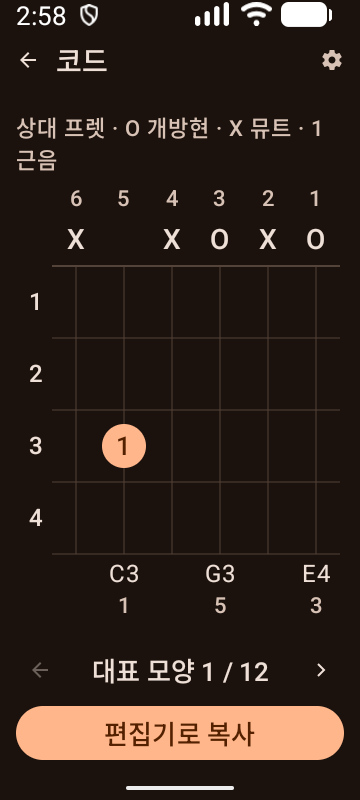

# Chord tool verification

Verified on 2026-10-05 against the [issue #10 contract](https://github.com/pekochan069/GuitarLearner/issues/10#issuecomment-5980962817) and its [implementation authorization](https://github.com/pekochan069/GuitarLearner/issues/10#issuecomment-5981041853).

Lookup exposes 12 roots and 36 qualities. Tuning and a full capo preserve relative stops while the tool recalculates actual pitches, candidates and the capo-free shape name. Representative search is bounded to relative frets 0–12 and four-fret windows, with up to 12 ranked results. No-result states describe that policy and do not guarantee physical finger reach.

Search and the horizontal six-string fretboard precede optional settings. Editing uses native toggle buttons to place notes or mute a selected position; numeric string controls expand on request or for invalid input. The native tuning/capo sheet preserves invalid text for correction; Save remains unavailable until the draft is valid. Home retains the documented two equal columns and icon to the left of its title.

## Horizontal fretboard revision

Module boundaries, UI/app debug lint, presenter unit tests and both debug APK builds passed. The presenter report contains 29 tests with zero failures. Five chord UI tests passed on the SM_S948N phone, covering direct fret selection and mute, 48 dp targets, saved-workspace persistence, corrupt-storage recovery, English/light and Korean/dark at 200% text, and English/light landscape at 200% text. Test storage uses isolated preferences. Clearing focus before opening tuning settings fixed the keyboard restoring and panning the screen on dismissal.

The installed app matched the accepted APK SHA-256 `7702A1F7232AEE079513F14BD1CA28E66290DD42660CFB6C6F3F92CDCD78F7FB`. Build and phone test logs remain in `build/chord10/fretboard-accepted-static.log` and `build/chord10/fretboard-phone-accepted-tests.log`. This bounded phone acceptance does not replace the full connected gate described below.

## Runnable checks

```powershell
.\gradlew.bat verifyModuleBoundaries lint :architecture-lint:test :domain:test :adapters:testDebugUnitTest :presentation:logic:testDebugUnitTest :app:assembleDebug :app:assembleDebugAndroidTest --offline --console=plain
pwsh -NoProfile -File scripts/verify-boundary-guard.ps1
.\gradlew.bat :app:connectedDebugAndroidTest --offline --console=plain
```

The original feature static gate passed (271 tasks). Local JUnit reports 105 tests, zero failures/errors/skips: domain 23, adapters 35, presenter 27 and architecture lint 20. Three forbidden dependency probes were rejected; the build file was restored. The Korean 200% error-recovery and fixed-half-width Home focused tests both passed without weakening assertions.

The first complete run after those corrections reported 54 cases, 52 passes, one native audio failure and one opt-in acoustic skip. Playback stalled after a 52.18 ms refill gap emptied its 40 ms queue during activity recreation. The installed APK hash matched the built artifact. That focused method failed again, then passed on clean main at 037cffd and on the unchanged feature APK. This establishes intermittent behavior; it does not prove a chord regression or a corrected audio defect. Audio buffering, fail-stop behavior and playback assertions remain unchanged. The confirmation run reported 54 cases: 49 passes, four failures and one acoustic skip. Three failures followed audio underruns; another was a 45-second warm-notification activity-launch timeout. All six chord UI/JSON cases and the fixed-half-width Home case passed in both full runs. A clean-main comparison group reproduced the same native underrun (10 emulator cases, one failure), confirming that this failure also exists without the chord feature. The full connected gate remains unpassed.

## Earlier emulator UI and persistence

The following layout observations and screenshots predate the horizontal fretboard revision.

Actual APK inspection covered 360x800 and 800x360 on the API 37 emulator, English/light and Korean/dark, normal and 200% text. All six strings fit the normal and enlarged portrait width. Tall enlarged diagrams and controls remain available through vertical scrolling in landscape. Native numeric-IME inspection showed the landscape capo value above the keyboard. Actual app locale also showed the Korean invalid-capo message; the UI fixture now configures the native view locale and font scale so dialogs use that same environment.

An actual cold-process journey, without injecting JSON, saved a named chord with edited tuning and capo, then changed the independent draft. After force-stop and a different process ID, the persisted document matched exactly and the saved original remained unchanged. Load restored the full context, repeated Save retained one stable ID, Delete detached the draft, and a second cold start did not resurrect the record. A later Save created a new ID. The two verification records were removed through the UI; production storage behavior was unchanged by the layout revision.





The emulator was restored to its physical 1080x2400 size, density 420, font 1.0, automatic rotation and original IME settings; app locale is System. A final Home capture was black despite a readable node tree and is inconclusive, so it is not used as appearance evidence. A phone connected during the baseline group and also ran those baseline tests (10 cases, five failures); this is not feature acceptance evidence.

Full failed logs, JUnit XML, cold-process snapshots and the append-only decision trail remain in `%TEMP%/GuitarLearner-chord10`. CI, full-suite phone acceptance, TalkBack, pre-API 33 locale and acoustic timing results are not claimed.
