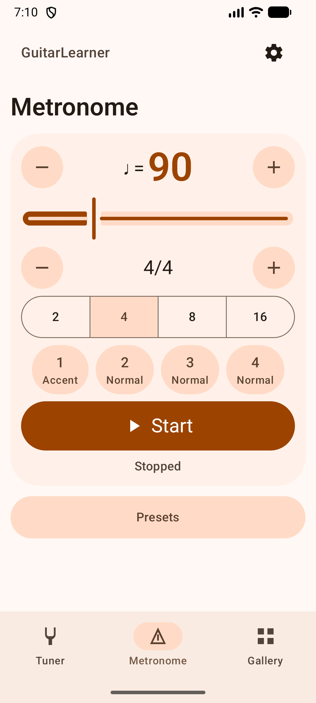
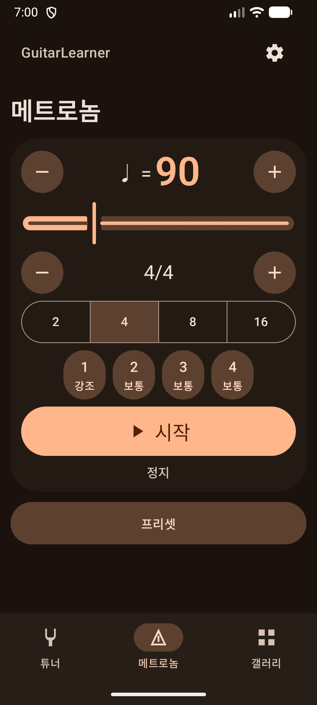
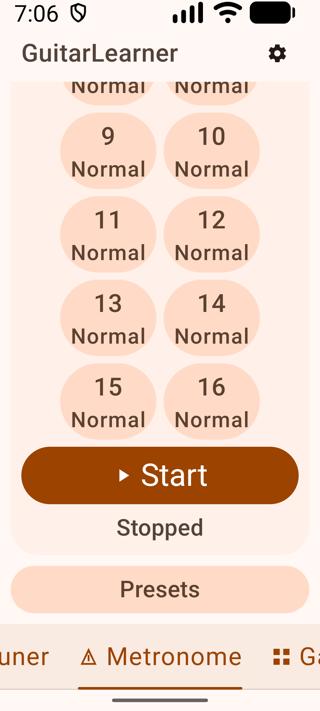
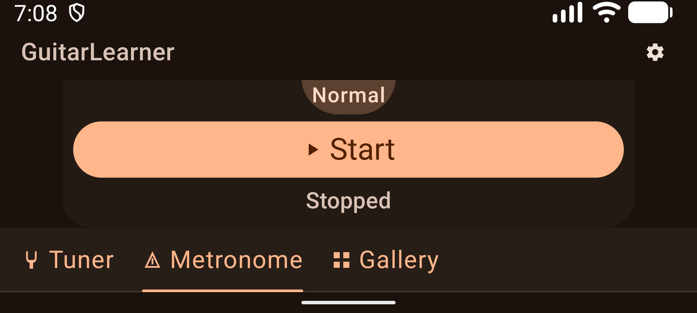

# Compact metronome verification

Verified on 2026-10-04 for [issue #7](https://github.com/pekochan069/GuitarLearner/issues/7), its [confirmed contract](https://github.com/pekochan069/GuitarLearner/issues/7#issuecomment-5976527408), and the later [quarter-note BPM correction](https://github.com/pekochan069/GuitarLearner/issues/7#issuecomment-5977297604).

## Result

The main practice surface combines tempo, meter, interactive beat accents, and Start/Stop. Default 4/4 at 360 × 800 dp fits without scrolling. Static introductory content and the permanent second accent editor are removed. Presets open in a native Material 3 bottom sheet; save, load, overwrite confirmation, delete, and entered-name restoration remain available.

BPM now always refers to quarter notes. At 90 BPM and 48 kHz, click spacing is 64,000 frames for half notes, 32,000 for quarter notes, 16,000 for eighth notes, and 8,000 for sixteenth notes. The numeric BPM, saved preset fields, and version 1 storage format are unchanged. Existing non-quarter presets therefore play at the new quarter-reference rate.

A successfully saved time-signature change during playback replaces the audio output and starts the new whole configuration at beat 1. The live session retains its service, media session, audio focus, wake lock, and interruption handlers. Output callbacks carry an epoch checked after their main-thread hop. Stop, interruptions, failures, and a later manual Start revoke an old edit's automatic restart authority. A stopped edit stays stopped. BPM-only and accent-only edits retain their respective beat/bar boundary rules.

| Option | Decision |
| --- | --- |
| Replace audio inside the live session | Selected. Preserves session ownership and avoids a second foreground-service start. |
| Recreate the whole session | Rejected. Adds focus/service churn to a meter edit. |
| Always await retired output release | Rejected. Existing pause/flush and track ownership checks suffice for the tested replacement path. |

## Automated checks

Commands ran in an isolated worktree using Android Studio's JBR. The committed dependency versions were used; unrelated dependency edits in the original checkout were preserved.

```powershell
$env:JAVA_HOME = 'C:/Program Files/Android/Android Studio/jbr'
.\gradlew.bat verifyModuleBoundaries lint :architecture-lint:test :domain:test :adapters:testDebugUnitTest :presentation:logic:testDebugUnitTest :app:assembleDebug :app:assembleDebugAndroidTest --console=plain
pwsh -File scripts/verify-boundary-guard.ps1
.\gradlew.bat :app:connectedDebugAndroidTest --console=plain
```

The static checks passed. JUnit XML reports 65 local tests with zero failures or skips: architecture lint 20, domain 13, adapters 22, and presenter 10. All three forbidden-dependency probes were rejected and their temporary build-file edits restored.

On the API 37.1 emulator, the complete connected rerun reports 30 cases: 29 passed, zero failed, and one acoustic recording case explicitly skipped. These include ten controlled-output host cases, ten presentation cases, eight native playback cases, and one foundation/restoration case. Controlled-output tests exercise the real host, storage wrapper, and service with simulated output presentation; native playback tests execute AudioTrack separately.

The first complete connected run had one failure in the existing background/recreation test. Android logged an output underrun after a 78.56 ms worker gap exceeded the existing 40 ms queue horizon at 40 BPM quarter notes. That note spacing is unchanged by this correction. The same source and APKs passed the isolated case and then the complete rerun. The failure log was retained; no buffer, threshold, or retry-code change was made. This leaves emulator scheduling sensitivity visible rather than establishing that underruns cannot occur.

The final resource-only preset-close fix followed that suite. Both product lint tasks and both APK builds passed again. Native UI inspection confirmed `Close presets` and `프리셋 닫기`. The full suite was not repeated for that label-only change.

Meaningful regression evidence includes:

- The literal 90 BPM note-value test failed the old formula before the correction. Fractional carry is checked over 100,000 beats at 137 BPM for every note value; minimum and maximum tempos are covered.
- PCM tests verify 240 BPM sixteenth-note clicks at 3,000-frame spacing across uneven render chunks, alongside accent/mute and marker behavior.
- A separate worktree temporarily removed the audio-epoch check. The stale-callback test failed because retired output changed the replacement's Preparing state to Failed. The mutation was restored.
- Native signature edits restart at the first presented beat of the new configuration. Storage failures, stale callbacks, blocked saves across Stop/new Start, focus loss, service destruction, and replacement failure are covered by controlled host tests.
- Native quarter/eighth presentation at 90 BPM measured callback-delivery means of 666.17 ms and 357.18 ms, a rate ratio of 1.865. Native 240 BPM sixteenth delivery averaged 72.93 ms. AudioTrack timestamps were used and that cadence case reported no underruns. These software callback measurements include main-thread jitter; they do not measure acoustic accuracy.

## Native UI inspection

The latest APK was inspected through ADB screenshots and accessibility trees at 360 × 800 dp portrait and 800 × 360 dp landscape. The following 16-beat, 200% text combinations were inspected at their upper and lower scroll positions:

| Language | Theme | Portrait | Landscape |
| --- | --- | --- | --- |
| English | Light | Controls wrap; Start and Presets reachable | Controls reachable by vertical scroll |
| English | Dark | Controls wrap; Start and Presets reachable | Controls reachable by vertical scroll |
| Korean | Light | Controls wrap; Start and Presets reachable | Controls reachable by vertical scroll |
| Korean | Dark | Controls wrap; Start and Presets reachable | Controls reachable by vertical scroll |

Default English/light and Korean/dark 4/4 views show all practice controls and the preset entry without scrolling. Beat taps visibly cycled Accent → Normal → Mute → Accent. Start, a live quarter-to-eighth edit, Stop, and the complete preset save/overwrite/load/delete journey were exercised. The temporary review preset was deleted. Automated UI assertions verify individual beat actions, 16-beat wrapping, truthful desired/applied state, restoration, and actual touch bounds of at least 48 dp. The native Slider's 44 dp input area was enlarged through the native Thumb layout; the 48 dp assertion was retained.

The existing app-wide navigation labels clip horizontally in 200% portrait text. Metronome controls remain readable and reachable. Home navigation is excluded by the confirmed contract; this is a remaining layout limitation, not an all-app large-text pass.

| Default English/light, 4/4 | Default Korean/dark, 4/4 |
| --- | --- |
|  |  |

| English 200% text after scroll | English landscape 200% text after scroll |
| --- | --- |
|  |  |

## Review and limits

Independent comment/annotation audits and parent source reviews covered host, rendering/presenter, tempo, and the localized close label. The work used native Codex gpt-6.1-sol agents under the user's model override, so independent lanes provided no model-family diversity.

The throughput checkpoint kept scope and baseline gates first, independent read-only design/review artifacts separate, one writer for coupled production state, and the parent as the sole emulator driver. Host, compact UI, timing, and resource-label changes were verified as separate commits. No product decisions remain open.

The principles that changed concrete choices were Model the Domain (reuse selected/applied configuration and run identity), Laziness Protocol (replace audio without a new coordinator), Exhaust the Design Space (compare three architecture sketches), Separate Before Serializing Shared State (isolated checkout and single production/device owners), Sequence Verifiable Units (verify successive host/UI/timing changes), Build the Lever (reusable package-checked UI capture), Attack the Premise (measure actual Slider input bounds), Test Behavior Not Implementation (mutation and literal timing regressions), and Prove It Works (native UI and AudioTrack checks).

Physical-device timing, acoustic quarter/eighth comparison, physical route removal during replacement, pre-API-33 locale behavior, and spoken TalkBack output remain unverified. Accessibility evidence is limited to semantics, labels, actions, and input bounds. No microphone recording was made. Device density, font scale, rotation, and app theme/language preferences were restored, with playback stopped. Raw logs, XML, screenshots, mutation evidence, and the append-only decision trail remain in the local `issue-7-artifacts` directory.
