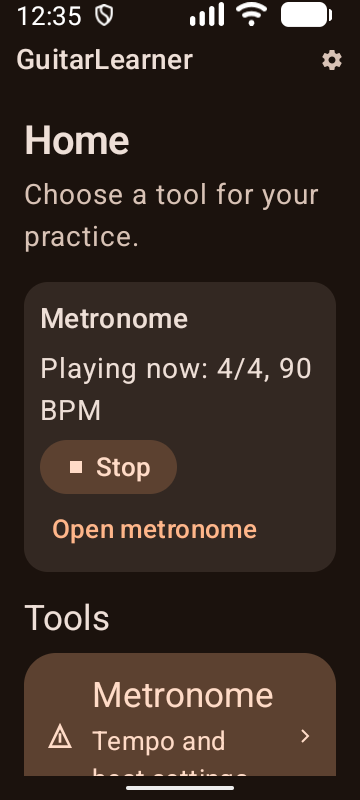
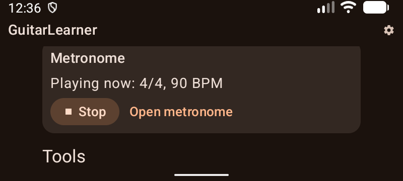
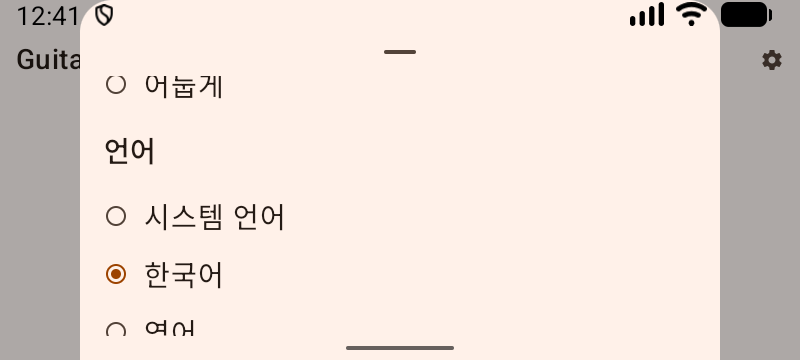

# Home menu verification

Verified on 2026-10-04 against [issue #8](https://github.com/pekochan069/GuitarLearner/issues/8), its [navigation contract](https://github.com/pekochan069/GuitarLearner/issues/8#issuecomment-5977091311), and the [confirmation](https://github.com/pekochan069/GuitarLearner/issues/8#issuecomment-5977103695).

## Behavior

Home lists usable features by category. Initially it shows Tools and Metronome; empty Training and Learning categories are hidden. Up and Back return features to Home after dismissing the current overlay. Shared settings remain in the top app bar. Tuner and component examples have a separate development entry enabled only by the debug app capability.

One persistent presenter owns typed destinations and an exclusive settings/presets/overwrite overlay. Stable saved identifiers normalize unavailable destinations to Home. Home keeps its scroll state outside destination content. The app handles platform Back and notification input; rendering still receives contract state and emits events. No dependencies or audio behavior changed.

On other screens, the compact metronome displays the actual playing configuration rather than selected pending edits. Open does not start or reset playback. Stop waits for the reported playback state; a failed Stop retains the controller and exposes an error. Preparing, interrupted and failed states remain distinguishable, with access to the metronome even when no controller remains.

## Automated evidence

Checks used the committed dependency stack in an isolated worktree. The original checkout's IDE, dependency and wrapper edits were preserved.

```powershell
.\gradlew.bat verifyModuleBoundaries lint :architecture-lint:test :domain:test :adapters:testDebugUnitTest :presentation:logic:testDebugUnitTest :app:assembleDebug :app:assembleRelease --console=plain
.\gradlew.bat :app:connectedDebugAndroidTest --console=plain
pwsh -File scripts/verify-boundary-guard.ps1
```

The final static run passed: 71 local tests, zero failures or skips (architecture lint 20, domain 13, adapters 22, presenter 16), all product lint, module boundaries, and debug/release assembly. All three forbidden-dependency probes were rejected, and the temporary build-file changes were restored.

The first connected run had 43 passes, four notification fixture failures and one explicit acoustic skip. ActivityScenario compares launch action/categories with `Activity.getIntent()`, while notification consumption sanitizes that intent. Notification journeys now use native instrumentation activity launch and lifecycle monitoring to exercise the real intents. All nine focused notification, Back and pending-input tests passed after that change. Existing playback and underrun assertions remain intact.

Independent review found a process-restoration defect that ordinary activity recreation did not expose. A cold notification launch followed by Home, background process termination and Recents resume reopened Metronome. Android retains its original launch intent separately from the app's sanitized intent. Restored creation now restores only pending input and sanitizes the old action; a genuine new delivery still arrives through `onNewIntent`. The same process-death journey then retained Home, and a new notification on the killed retained task opened Metronome once with Home as its Back destination. Both paths were verified on API 37 with different process IDs before and after restoration.

The final complete API 37 connected run passed: JUnit XML reports 48 cases, 47 passes, zero failures and one opt-in acoustic skip. Coverage includes production Home visibility, unavailable destination restoration, retained Home scroll, actual/pending playback, failed Stop, truthful preparation, late preset completion, overlay Back order, locale/theme/sample restoration, grid/preset behavior, native playback and actual notification PendingIntent task/activity/service/media-session reuse.

## Installed UI and release evidence

The final release APK was signed locally with the debug key for installation; its application flags were not debuggable. Release settings had no development section. An explicit sample action and destination extra left Home unchanged. No build signing configuration changed.

Manual inspection used 360 × 800 dp and 800 × 360 dp on the API 37 emulator, English/dark and Korean/light views, normal and 200% system font. Home cards, compact controls and settings remained reachable through native scrolling. At 200% text, portrait compact actions wrap; landscape actions use 54 dp touch heights. The settings action has a 48 × 48 dp target. Home scroll survived opening a feature and returning with Up. System Back at Home followed normal Android background behavior while the metronome continued playing; returning retained Home and the actual configuration. Stop then removed the compact controller.

System Back dismissed an overwrite confirmation, then the preset sheet, then the feature, in that order. The draft remained available after reopening, and the temporary QA preset was deleted. Automated delayed-command tests cover completion after dismissal, while real UI inspection covers the native overlay stack.

After inspection, the debug APK was reinstalled. Device size/density, 100% font, rotation and automatic rotation were restored, along with Korean/light appearance and the previously visible 100 BPM, 8/8 selection. Playback was stopped. Raw XML, logs, design/review reports and signed local release evidence remain in `%TEMP%/GuitarLearner-home-8-20261004-201742`.

| Installed release view | Evidence |
| --- | --- |
| Korean/light Home |  |
| English/dark, playing at 200% text |  |
| English/dark landscape, 200% text |  |
| Korean/light Home, 200% text |  |
| Korean/light settings landscape, 200% text |  |

## Review

Three independent design lanes selected typed destinations in one presenter; the synthesis adopted an exclusive overlay state and app-owned platform input. Independent comment and correctness reviews plus parent review covered the diff. All lanes used the configured Codex model, with no model-family diversity.

Model the Domain shaped destinations and overlays. Laziness Protocol kept one presenter and existing audio ownership. Separate Before Serializing Shared State kept implementation and device ownership distinct. Test Behavior and Prove It Works required real task, notification, release and UI journeys. Code and evidence form separate verifiable commits.

Physical-device behavior, pre-API-33 locale behavior and spoken TalkBack output remain unverified. Accessibility evidence covers labels, semantics, touch bounds and manual screen inspection. Acoustic recording is opt-in and skipped; this change makes no hardware timing claim.
