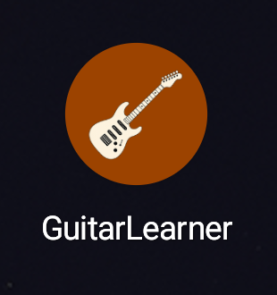
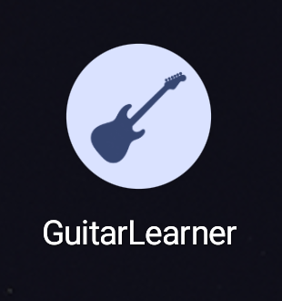

# Launcher icon

The user supplied `guitar-learner-icon.png` for [issue #18](https://github.com/pekochan069/GuitarLearner/issues/18). `artwork/launcher/guitar-learner-icon.png` preserves the original bytes.

Source SHA-256 is `629D8F99FA0773F4427ED20F6EDCBC432BAAEB6CD1F1A1AB2B369E58FEFB585C`.

The generator trims transparent padding and fits the guitar uniformly within a 48dp box on a 108dp layer. It writes one centered 432x432 RGBA foreground and checks that every positive-alpha pixel corner lies inside the 33dp safe circle. The normal and round adaptive icons use an orange `#9C4300` background and share the foreground alpha for monochrome. These layers follow the [Android adaptive icon guidance](https://developer.android.com/develop/ui/compose/system/icon_design_adaptive).

With ImageMagick 7's `magick` command on `PATH`, run these commands from the repository root.

```powershell
pwsh -File .\scripts\generate-launcher-icon.ps1
pwsh -File .\scripts\generate-launcher-icon.ps1 -Check
```

`-Check` compares decoded committed pixels with a temporary regenerated image. ImageMagick remains a manual asset-generation tool outside the app build.

## Verification

On 2026-10-04, generation and `-Check` passed with ImageMagick 7.1.2-1. Repeated generation produced identical bytes. The measured alpha pixel-corner radius was 31.40dp.

The following command passed with Gradle 9.5.0 and JDK 25.0.3. App lint reported zero errors and zero warnings.

```powershell
.\gradlew.bat verifyModuleBoundaries :app:lintDebug :app:assembleDebug --console=plain
```

The APK's foreground matched the generated image's decoded pixels. Both compiled adaptive icons shared the foreground and monochrome resource. The full-resolution source and the obsolete launcher WEBPs were absent from the APK.

The installed APK passed visual inspection on an API 37 emulator with Pixel Launcher. Default style retained the guitar body, headstock, and tuner tips with Circle, Square, and 4-sided cookie shapes. Minimal style displayed the guitar silhouette with Circle. Tapping the launcher icon opened GuitarLearner.

These are cropped screenshots from the installed app's launcher entry.

| Default style, Circle | Minimal style, Circle |
| --- | --- |
|  |  |

## Asset choices

| Shape | Decision |
| --- | --- |
| One generated 432px foreground | Selected. One regeneration command owns fitting and alpha validation. |
| Five density-specific foregrounds | Rejected. Four additional generated outputs for this static icon. |
| Original 1254px PNG with an XML inset | Rejected. Packages the full source and requires a separate inset calculation. |

The source and design gates preceded implementation. Three independent design reports used separate files, and one writer owned the icon worktree. Device verification had one owner. All configured review lanes used Codex `gpt-6.1-sol` with maximum reasoning; the panel had no provider diversity.

Laziness Protocol selected one foreground and removed obsolete assets. Model the Domain kept geometry in one IconSpec. Build the Lever supplied regeneration and decoded comparison. Exhaust the Design Space compared the three asset shapes. Separate Before Serializing Shared State kept reports and writes isolated. Prove It Works required APK and installed-launcher inspection. Sequence Work into Verifiable Units kept the asset change as one checked commit. No product decisions remain open.
